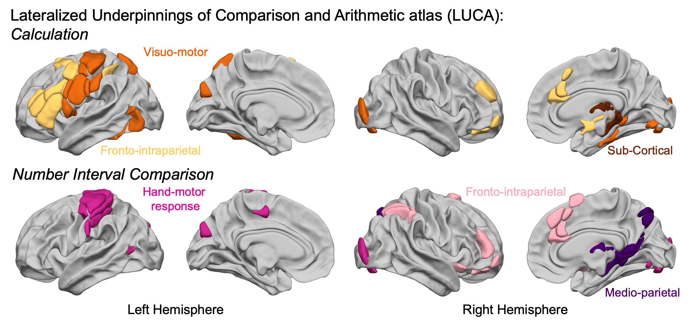

Lateralized Underpinnings of Comparison and Arithmetic atlas (LUCA)
================

<!--  -->

------------------------------------------------------------------------

In accordance with the
[SENSAAS](https://github.com/loiclabache/SENSAAS_brainAtlas),
[ALANs](https://github.com/loiclabache/ALANs_brainAtlas),
[WMCA](https://github.com/loiclabache/WMCA_brainAtlas), and
[HAMOTA](https://github.com/loiclabache/HAMOTA_brainAtlas) atlases, this
repository introduces the
[**LUCA**](https://doi.org/10.1101/2025.11.23.690045) atlas, which
encompasses 60 specifically selected regions underpinning the
**anatomical and functional bases of numerical cognition** in humans.

------------------------------------------------------------------------

## Reference

For usage of the ***atlas***, please cite:

- **Labache, L.**, Hesling, I., & Zago, L. (2025). Independent
  Lateralization of Language, Attention, and Numerical Cognition Across
  Task and Rest. *BioRxiv*. DOI:
  [10.1101/2025.11.23.690045](https://doi.org/10.1101/2025.11.23.690045)

------------------------------------------------------------------------

## Background

The **Lateralized Underpinnings of Comparison and Arithmetic (LUCA)**
atlas defines the large-scale, hemispherically lateralized brain
networks that support numerical cognition. Using multimodal fMRI in a
large sample of typically left-lateralized individuals for language,
LUCA isolates the regions that show robust leftward or rightward
activation and asymmetry during two core numerical tasks: **mental
calculation** and **numerical interval comparison**.

LUCA formalizes numerical cognition into **six lateralized functional
networks**. For **calculation**, *three* networks are identified:

- a **left-lateralized fronto-intraparietal** network supporting
  symbolic manipulation,

- a **bi-hemispheric visuo-motor network** integrating visual numeral
  processing with motor planning,

- and a **right-lateralized subcortical network** involved in gating and
  memory processes.

For **numerical comparison**, *three* networks emerge:

- a **right-lateralized fronto-intraparietal networ** for evidence
  accumulation and decision-making,

- a **right-lateralized medio-parietal network** for magnitude mapping,

- and a **left-lateralized hand-motor network** supporting response
  selection.

Together, these six networks provide a comprehensive and reproducible
framework for studying the neural foundations of arithmetic and number
comparison in both healthy individuals and clinical or developmental
populations.

------------------------------------------------------------------------

## Data release

The `Atlas` folder contains three files:

- `read_me_LUCA.rtf`: README file containing information. about the
  atlas
- `LUCA_description.txt`: text file containing a full description of
  each regions.
- `LUCA_Calc_MNI_ICBM_152_2mm.nii.gz`: NIfTI file containing the 43
  calculation regions in the MNI space.
- `LUCA_Comp_MNI_ICBM_152_2mm.nii.gz`: NIfTI file containing the 37
  numerical interval comparison regions in the MNI space.

------------------------------------------------------------------------

## Other papers and atlases that might interest you

- Atlas of Lateralized visuospatial Attentional Networks:
  [ALANs](https://github.com/loiclabache/ALANs_brainAtlas)
- SEntence Supramodal Areas AtlaS:
  [SENSAAS](https://github.com/loiclabache/SENSAAS_brainAtlas)
- Word-list Multimodal Cortical Atlas:
  [WMCA](https://github.com/loiclabache/WMCA_brainAtlas)
- HAnd MOtor Area atlas:
  [HAMOTA](https://github.com/loiclabache/HAMOTA_brainAtlas)
- Language-and-Memory atlas:
  [L∪M](https://github.com/loiclabache/RogerLabache_2023_LanguAging/)

------------------------------------------------------------------------

## Questions

Please contact me (Loïc Labache) at: <loic.labache@rutgers.edu> and/or
<loic.labache@ensc.fr>
